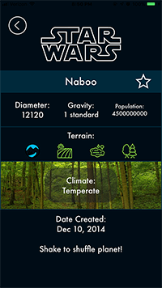

# StarWars-Project
Star Wars database app that displays every planet and character from the Star Wars universe and their details.

## Features
### Planet Library
* An interactive table view that displays every planet from the Star Wars universe.
* A detail view that display info on selected planet such as diameter, gravity, population, climate, etc.
* Icons that represent different terrains such as desert, mountain, etc.
* Different images for each climate, for example artic, arid, temperate, tropical, etc

### People Library
* An interactive table view that displays every character from the Star Wars universe.
* A detailed view that display info on selected character such as hair color, eye color and birth year.
### Other Features
* Save your favorite planets or characters.
* Shake your phone to select random planets or characters

## Images 

## Prerequisites

* Xcode 10.2.1
* iPhone running  iOS 12

## Installing

* No cocoapods
* Run simulator on Xcode

## Author
Leandro Wauters

